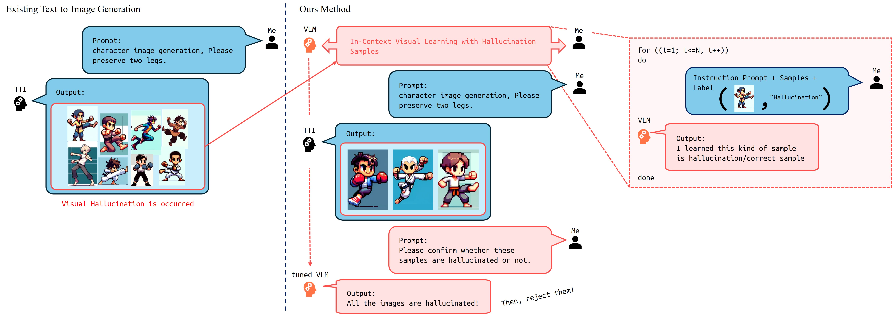

# Cartoon-Hallucinations-Detection
 
### [Project Page](https://gh-bumsookim.github.io/Cartoon-Hallucinations-Detection/) | [Paper](https://openaccess.thecvf.com/content/WACV2025/html/Kim_Make_VLM_Recognize_Visual_Hallucination_on_Cartoon_Character_Image_with_WACV_2025_paper.html) | [Supp](https://openaccess.thecvf.com/content/WACV2025/supplemental/Kim_Make_VLM_Recognize_WACV_2025_supplemental.zip) | [arXiv](https://arxiv.org/abs/2403.15048) | [Poster](https://drive.google.com/file/d/1aiq-JKWZ3A-t2-gzFV4nTVYcvbH-rZiY/view?usp=sharing) | [Dataset (Hugging Face)](https://huggingface.co/datasets/Wseop/PA-ICVL-DataSet)


This is official repository of 'Make VLM Recognize Visual Hallucination on Cartoon Character Image with Pose Information', accepted at WACV 2025.





IEEE/CVF Winter Conference on Applications of Computer Vision (WACV) 2025


[Make VLM Recognize Visual Hallucination on Cartoon Character Image with Pose Information](https://openaccess.thecvf.com/content/WACV2025/html/Kim_Make_VLM_Recognize_Visual_Hallucination_on_Cartoon_Character_Image_with_WACV_2025_paper.html) <br>
[Bumsoo Kim<sup>1*](https://scholar.google.com/citations?user=JlNb4R8AAAAJ), 
[Wonseop Shin<sup>1*](https://scholar.google.com/citations?user=gVAxCO0AAAAJ), 
[Kyuchul Lee<sup>2](https://scholar.google.com/citations?user=jXiLuh8AAAAJ), 
[Yonghoon Jung<sup>1](https://scholar.google.com/citations?user=E-BJvbsAAAAJ), 
[Sanghyun Seo<sup>1](https://scholar.google.com/citations?user=k1SL428AAAAJ), <br><sup>1</sup>Chung-Ang University, South Korea. <sup>2</sup>Coupang, South Korea. <br> <sup>*</sup>Equal Contributors


## bibtex

```
@InProceedings{Kim_2025_WACV,
    author    = {Kim, Bumsoo and Shin, Wonseop and Lee, Kyuchul and Jung, Yonghoon and Seo, Sanghyun},
    title     = {Make VLM Recognize Visual Hallucination on Cartoon Character Image with Pose Information},
    booktitle = {Proceedings of the Winter Conference on Applications of Computer Vision (WACV)},
    month     = {February},
    year      = {2025},
    pages     = {5398-5407}
}
```